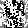
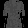
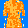
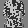
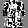

# 数据集展示部分

---

# 引言

--- 

# 实验
## 对Fashion-MNIST数据集初步进行对抗攻击

在进行初步攻击后，我们发现背景处有明显的噪点，通过以下图片有更清楚的认知

## 优化 1 ：使用掩膜规定可攻击区域，非可攻击区域不进行添加扰动
### 定义：使用梯度掩膜法（Gradient Masking）进行可攻区域规定
- 原理 ：利用原图生成一个“掩膜”（Mask），只在有物体的地方（像素值 > 阈值）允许修改。
- 做法 ：计算出对抗扰动后，将其乘以原图的二值化掩膜。即： 最终扰动 = 原始扰动 × (原图 > 0) 。
- 效果 ：背景强制保持纯黑，扰动只附着在衣服/鞋子本体上，视觉干扰最小。

### 具体实施方案
1. 生成掩膜 (Mask) ：
   
   - 在计算扰动之前，先基于输入的原图 image 生成一个二值掩膜。
   - 判定标准 ：如果某像素值大于 0（或者一个极小的阈值，如 0.05），则标记为 1（前景）；否则标记为 0（背景）。
2. 应用掩膜到梯度 ：
   
   - 原本的公式是 perturbation = epsilon * sign(data_grad) 。
   - 修改后 ：将计算出的 sign(data_grad) 乘以第一步生成的掩膜。
   - 这样背景区域的梯度符号会被强制置为 0，从而不会产生任何扰动。
3. 叠加扰动 ：
   
   - 剩下的步骤保持不变： perturbed_image = image + masked_perturbation 。
   - 最后依然进行 clamp(0, 1) 截断，确保像素值合法。
预期效果 ：
生成的对抗样本在纯黑背景区域将保持绝对纯黑，只有衣服/物体主体上会有噪点，视觉上会干净很多。

划分出来的掩膜（可攻击区域）如下所示

攻击后效果呈现

## 优化 2 ：对抗样本与原图相比仍存在较突兀的噪点显示，增加迭代式攻击(I-FGSM / PGD)

目前使用的是单步攻击（FGSM），虽然快但攻击力有限。改为多步迭代攻击（Projected Gradient Descent），即“小步快跑”多次施加扰动，可以在更小的总扰动下达到更高的攻击成功率，且图像质量更好。

前者是大步跑，后者是小步走。
在 quick_fgsm_attack.py 中，我们实现了两种不同的梯度攻击逻辑：

- FGSM (Fast Gradient Sign Method)
  
  - 逻辑 ：这是“一锤子买卖”。它计算一次梯度，然后沿着梯度的方向一次性迈出一大步（步长为 $\epsilon$）。
  - 特点 ：速度极快，但攻击往往比较粗暴，容易产生较大的噪点，且攻击成功率相对较低。
  - 代码体现 ： fgsm_attack 函数中，直接计算 image + epsilon * sign(grad) 。
- I-FGSM (Iterative FGSM)
  
  - 逻辑 ：这是“小步快跑”。它将总的攻击强度 $\epsilon$ 拆解为多个小步（ iters 步）。
  - 过程 ：在每一步中，它只沿着梯度方向走一小步（步长 $\alpha$），然后立刻检查是否跑偏了（是否超出了 $\epsilon$ 的限制范围），如果超出了就裁剪回来（Project）。这样循环多次。
  - 特点 ：攻击更精准，扰动更细腻（肉眼更难察觉），攻击成功率通常更高。
  - 代码体现 ： iterative_fgsm_attack 函数中包含一个 for 循环，反复执行 x_adv = x_adv + alpha * sign(grad) 和 clip 操作。

### 结果呈现

## 优化 3 ：从无目标攻击到靶向攻击
目前的攻击是“只要分错就行”（无目标攻击）。我们希望改进为“指定错分成某类”（例如把所有鞋子都伪装成包包）。

### 实现方案
- 无目标攻击（现状） ：旨在让模型 预测出错 。
- 数学目标： 最大化 原始类别（或当前预测类别）的 Loss。
- 操作方向：沿着梯度 上升 的方向（Gradient Ascent）修改图片，即 image + epsilon * sign(grad) 。
- 靶向攻击（目标） ：旨在让模型 预测为特定类别 （例如把“裤子”识别为“裙子”）。
- 数学目标： 最小化 目标类别（Target Class）的 Loss。
- 操作方向：沿着梯度 下降 的方向（Gradient Descent）修改图片，即 image - epsilon * sign(grad) 。

### 实现步骤
修改 quick_fgsm_attack.py (底层算法)
我们需要更新 iterative_fgsm_attack 和 attack_one 函数，增加 target_label 参数。

- 对于 FGSM ( attack_one ) ：
  - 如果传入了 target_label ：计算该 label 的 Loss，并将计算出的梯度 取反 （ -grad ），然后传给现有的 fgsm_attack 函数（因为它是做加法）。这样就实现了 x - epsilon * grad 的效果。
- 对于 I-FGSM ( iterative_fgsm_attack ) ：
  - 在迭代循环中，如果指定了 target_label ，我们计算针对该 label 的 Loss，并在更新图像时使用 减法 ( x_adv - alpha * step )。
  - 如果是无目标攻击，保持原有的 加法 ( x_adv + alpha * step )。

### 结果展示
将 T-Shirt 攻击为 Trouser

---

# 结果

---

# 讨论与展望